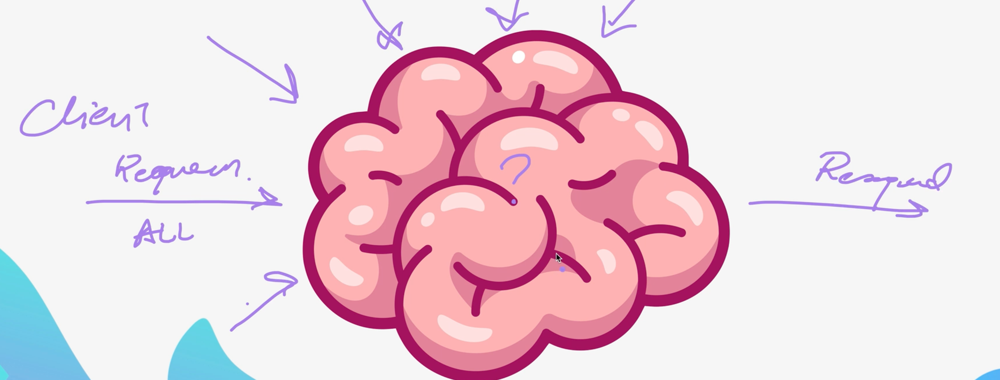

# Section 30 Notes

## What makes an API RESTful?

    1: HTTP Methods

        - GET

        - POST

        -  PUT

        - PATCH

        - DELETE

    2: JSON Output

    3: Client - Server

        - Client and server are separate

        - Client and server can scale up or down independently from each other

    4: Stateless

        - Each request can be complete and each request can be complete without knowing previous states

    5: Resource-Based
        - Uses universal resource identifier/locator